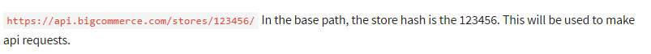

# Lab - Getting Started

**Prerequisites**

* Owner permissions within a live/test BigCommerce Store (required for API credential creation)
* Admin permission on your computer
* Basic knowledge of HTML, Sass, and Handlebars
* Node.js 20 or later ([nvm](https://github.com/nvm-sh/nvm) recommended)
* The [Git](https://git-scm.com/) CLI

## Authentication

Two types of API credentials are available to developers wishing to make requests against BigCommerce APIs.

These credentials are used to programmatically interact with an individual store's data using BigCommerce's APIs. The two types of API credentials are:

* **Store API Credentials** (created in a store's control panel)
* **App API Credentials** (created in the Developer Portal)

In this course, we focus on the Store API credentials. Both OAuth and token-based authentication are possible with Store API Credentials. Store API Credentials are generated when a Store API Account is created in a store's control panel: Settings &gt; API.

Access to API keys depends on user permissions set by the store owner. If you do not have access to API keys, ask the store owner to change your user permissions in the control panel.

When setting the theme scope to modify, note the difference between read-only and modify:


| **Read-only** | **Modify** |
| --- | --- |
| Read-only lets you connect so you can use the browsersync preview. | Modify lets you push a theme to a store using the command line, instead of having to bundle it and upload the zip file through the control panel. |



### API Path

A successful save will display a pop-up containing the API credentials you need to run authenticated requests - your **Client ID** and **Access Token**. A .txt file containing the same credentials will (on most browsers) automatically download to your computer. This file contains the base API Path for your store, preconfigured for the v3 API.

The base API path will look something like the image to the right.

**Make sure to keep your API credentials in a safe place as you will no longer be able to access them from the BigCommerce control panel.**

## Step 1: Create an API Account

1. **Log in** to the store you will be developing on
2. **Navigate** to Settings &gt; API Accounts
3. **Click** Create API account and **select** Create Stencil-CLI Token

Access to API keys depends on user permissions set by the store owner. If you do not have access to API keys, ask the store owner to change your user permissions in the control panel.

4. **Add** a Name
5. **Set** the Stencil-CLI Access Level to Publish Theme

When setting the theme scope to publish theme, note the difference between local development only and publish theme:


| **Local Development Only** | **Publish Theme** |
| --- | --- |
| Can read theme-related store data, but can not publish | Can read theme-related store data and push themes to the live storefront |

6. **Click** Save

## Step 2: Install Stencil CLI

This step only needs to be performed once for a specific version of Node.js.

1. **Run** the following command to install the Stencil CLI tool.

```bash showLineNumbers={false}
npm install -g @bigcommerce/stencil-cli
```

Remember to make sure you have Node.js 20 or later running before installing the package. If you're using Node Version Manager:

`nvm use 20`

The command will install the _stencil-cli_ package globally. This will allow you to use it in multiple Stencil theme projects using the same version of Node.js.

**ARM Based Macs**

For ARM based Macs, you will need to run the following before installing the package:

`arch -x86_ 64 /bin/zsh`

**Installing Dependencies on Windows**

See the [BigCommerce documentation](https://docs.bigcommerce.com/developer/docs/storefront/stencil/cli/install) for more details on options for installing dependencies on Windows before installing the Stencil CLI package.

Versions are subject to change; ensure you are using a supported Node version. If you are experiencing issues, review our Developer Documentation on [Troubleshooting Your Setup](https://docs.bigcommerce.com/developer/docs/storefront/stencil/cli/unexpected-behavior).

2. **Test** the _stencil_ command and **verify** that a list of possible sub-commands is output.

```bash showLineNumbers={false}
stencil -h
```

## Step 3: Clone the Cornerstone Theme

1. **Use** the following command to clone the base theme into your chosen directory

```bash showLineNumbers={false}
git clone https://github.com/bigcommerce/cornerstone.git
```

If the above command fails and you are accessing GitHub anonymously, give the URL the `git` prefix:

`git clone git://github.com/bigcommerce/cornerstone.git`

2. **Use** the following command to move into the theme directory

```bash showLineNumbers={false}
cd ~/Cornerstone
```

A folder called &quot;Cornerstone&quot; was automatically downloaded in step 1. If you created a specific folder for this project you will need to call up the path to the folder.

ex. The Cornerstone theme was cloned to a folder called &quot;Development&quot;.

`cd ~/Development/Cornerstone`

3. **Navigate** **to** the theme directory (Cornerstone) and **run** the following command to install Stencil's JavaScript dependencies

```bash showLineNumbers={false}
npm install
```

## Step 4: Initialize and Launch Stencil CLI

1. **Use** the following command in the theme directory

```bash showLineNumbers={false}
stencil init
```

2. **Enter** the website URL (ie. `https://websiteurl.com)` for the theme you are developing for
3. **Enter** the port you would like to run the store on (we recommend the default 3000)
4. **Enter** your Access Token
5. **Observe** confirmation that Stencil is initialized
6. **Use** the command below in the theme directory to launch the CLI

```bash showLineNumbers={false}
stencil start
```

7. **Observe** the list of URLs to access the local store
8. **Navigate** to the store (ex. localhost:3000)


**Quickstart Command**

The quickstart command produced by the control panel is &quot;stencil init&quot; with the -p -t and -u options to define the port, token, and URL respectively.

For example:

`stencil init -p 3000 -t <API_TOKEN> -u https://my-cool-store.mybigcommerce.com`


If you encounter any issues, view the Stencil Documentation [Troubleshooting Your Setup](https://docs.bigcommerce.com/developer/docs/storefront/stencil/cli/unexpected-behavior).
