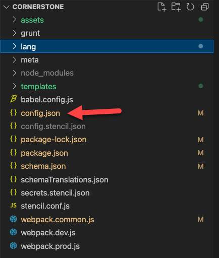
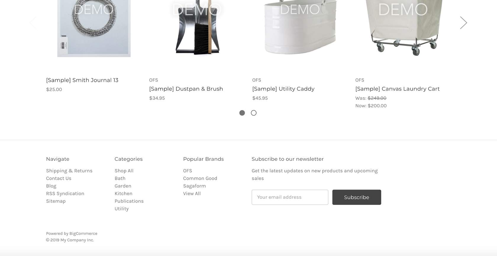
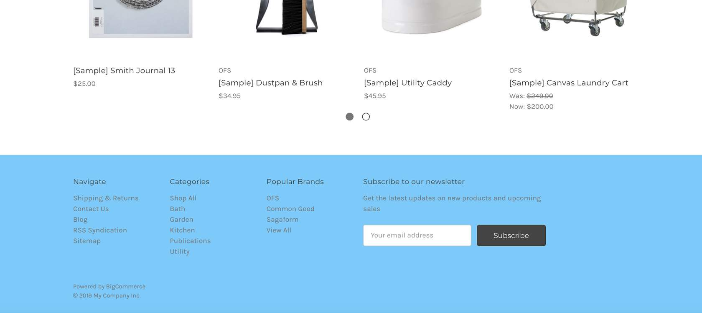
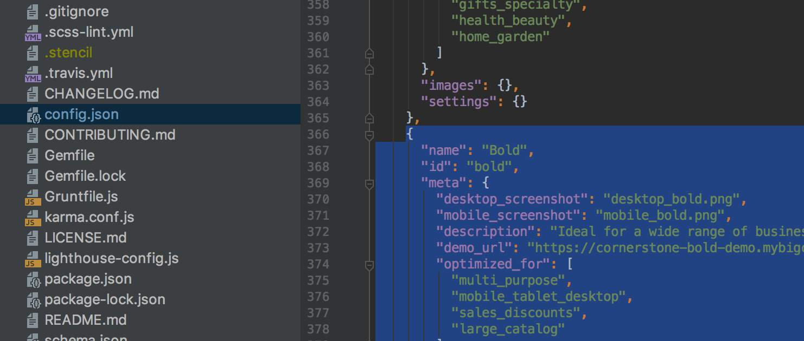
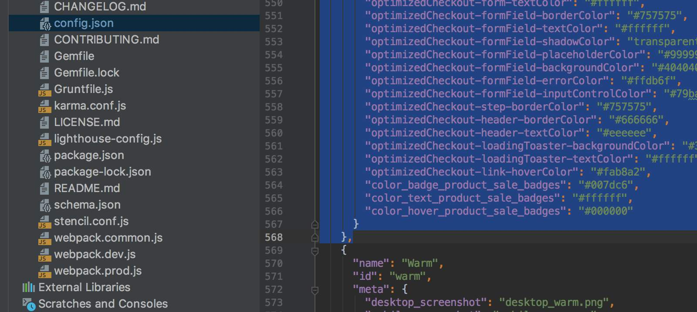
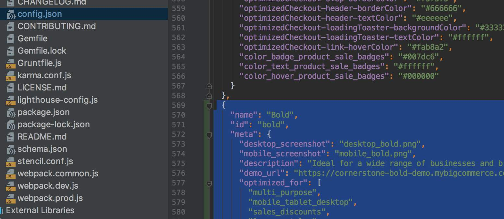
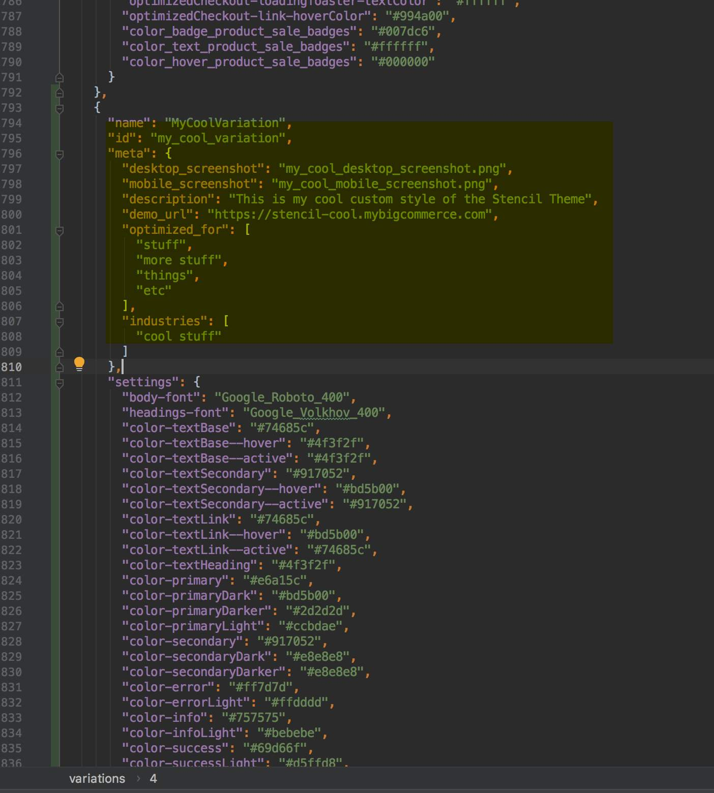
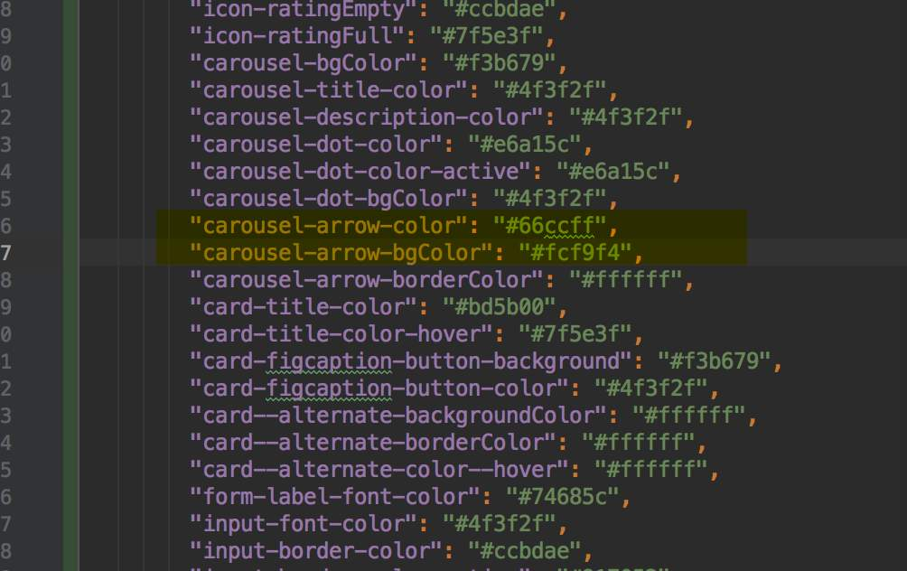
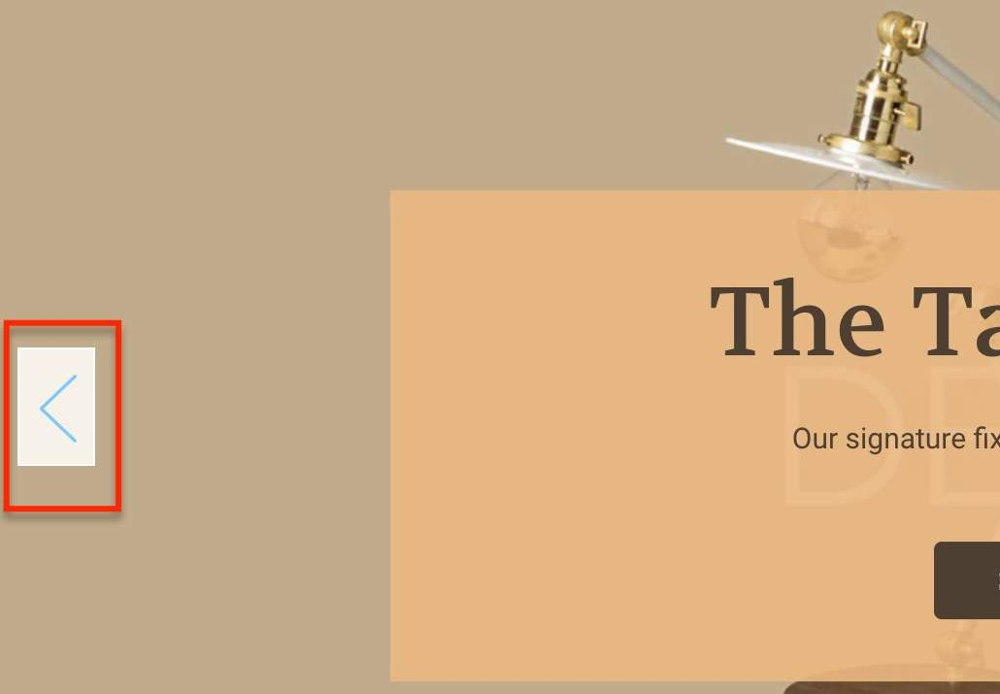

# Lab - Edit `config.json`

**Prerequisites:**

* BigCommerce Store (sandbox or live)
* Stencil CLI installed
* Cornerstone base theme installed
* Preferred IDE is installed and the Cornerstone theme is open

## Introduction

You will be able to configure the /theme‑name/config.json file to properly manage each of your custom theme's frontend aspects. The config.json file functions:

* Provide global context for Stencil's CSS and Handlebars resources
* Provide values for the Store Design GUI to manage
* Provide metadata for your theme's listing in the Theme Marketplace
* Define variations included in your theme

### Configure config.json Keys

The first thing you must do when beginning theme developement is configure certain values in the `cornerstone/config.json` file. For example, here are the first few key/value sets in Cornerstone's config.json:

```json showLineNumbers={false}
{
"name": "Cornerstone",
"version": "1.0.0",
"meta": {
  "price": 0,
   "documentation_url":
   "https://support.bigcommerce.com/articles/Public/Cornerstone-
   	Theme-Manual",
  ...
  }
}
```

The next code block shows how you might change these values to reflect your own theme's name, version number, price on Theme Marketplace, and documentation URL. These values also appear in a client's store if the theme is not published in the marketplace. Naming and versioning themes is a good practice even if you have no intent to distribute the theme via the marketplace:

```json showLineNumbers={false}
{
"name": "MyTheme",
"version": "1.1.2",
"meta": {
  "price": 10000,
  "documentation_url": "https://www.mywebsite.com/theme-docs/my-theme.html",
  ...
  }
}
```

### config.json Interactions

To customize your theme's appearance at a global level, the values that you define in the _&lt;theme-name&gt;/config.json_ file interact with local resources. Your config.json definitions set global defaults for templates, front-matter attributes and Handlebars resources throughout your theme. You can also define custom variables in config.json, named according to your needs.



**Open config.json** From the locally installed Stencil Theme, open config.json file.


## Step 1: Change Settings in config.json

1. **Open** the locally installed Cornerstone theme in your IDE
2. **Ensure** the _CLI is initialized_ an the _theme is launched_ on local host 3000

Please see [Stencil Docs](http://docs.bigcommerce.com/developer/docs/storefront/stencil/getting-started) for reference files.

3. **Open** config.json in your IDE
4. **Locate** &quot;footer-backgroundColor&quot;
5. **Replace** the hex color value with #66ccff
6. **Observe** change on local host 3000

**Before**


**After**


## Step 2: Create a Variation

1. **Locate** the Variations section in config.json
2. **Copy** the entire section for the "Bold" variation, from the opening bracket by the variation name down to just before the opening bracket for the next variation.





3. **Paste** the variation contents below the existing "Bold" variation.



4. **Edit** the pasted variation head to designate a new variation for the theme.



5. **Change** the "carousel arrow color" to "#66ccff"
6. **Change** the "carousel arrow bgColor" to "#fcf9f4"



7. **Launch** Stencil with the stencil start -v option. You&#39;ll want to include your variant name in the command prompt, like below:

```bash showLineNumbers={false}
stencil start -v MyCoolVariation
```

If Stencil is already running, you will need to end the process and start again with the -v. Use the following command to stop Stencil:

`CTRL+C`

8. **Observe** carousel arrows changed to blue.



Before proceeding to the next lab, either switch back to the original variation (**stencil start**), or ensure you are making changes in the **Settings** of the variation created above.
