# Lab - Customize Components and Layout

**Prerequisites**

* Previous labs have been completed

Before proceeding, either switch back to the original variation (**stencil start**), or ensure you are making changes in the **Settings** of the variation created above.

## Components

### Step 1: Rearrange Components on a Page

1. **Navigate** to Templates > Components > Common
2. **Open** templates/components/common/header.html
3. **Locate** and **cut** the following snippet:

```text showLineNumbers={false}
{{> components/common/navigation-menu}}
```

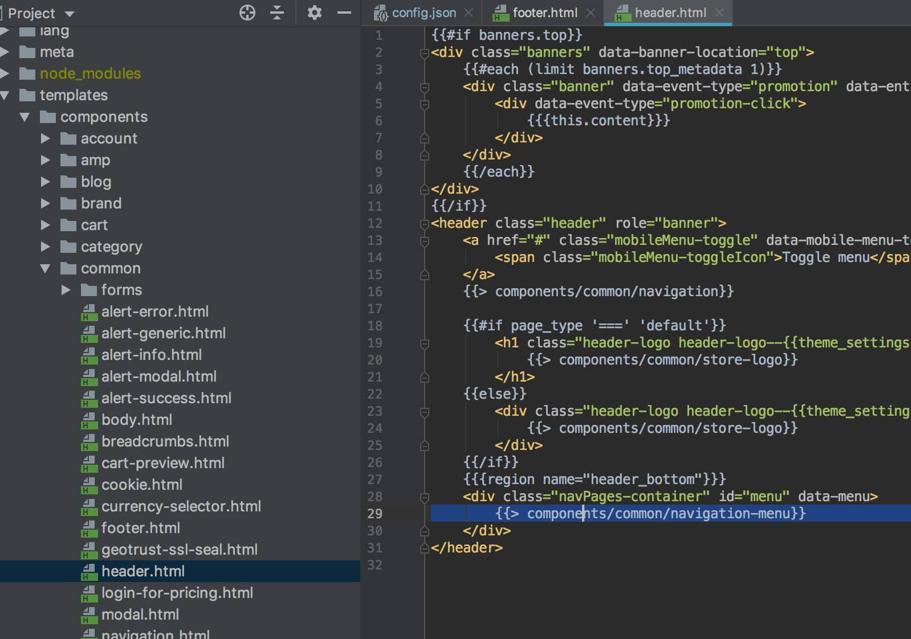

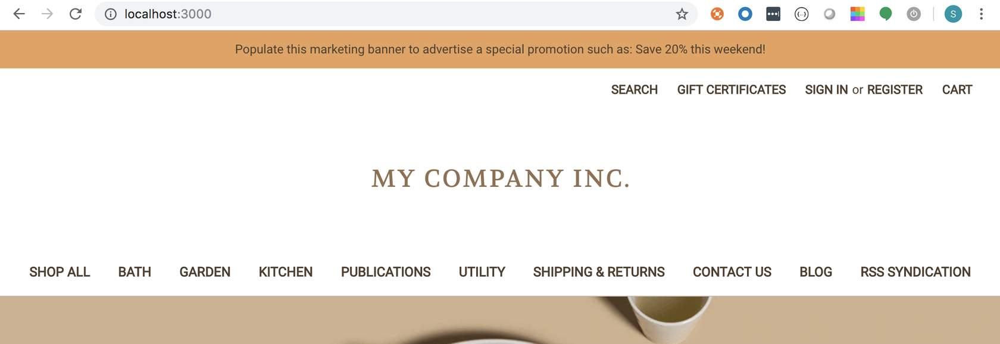


4. **Paste** at the very top of the file


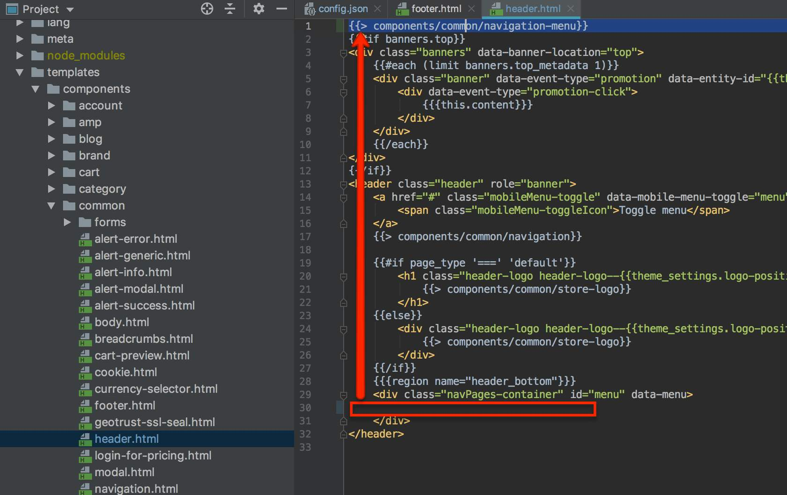

5. **Observe** navigation menu moved to top of page

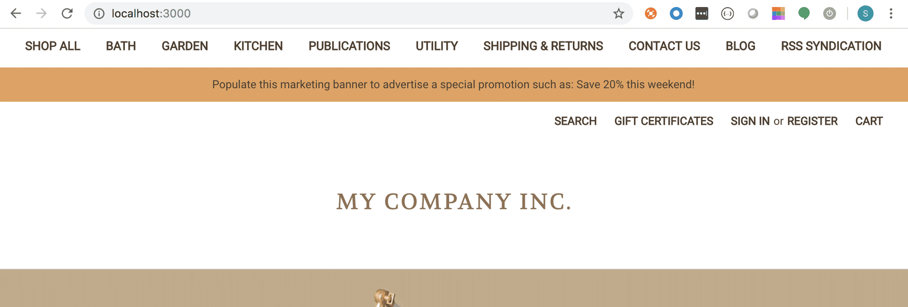

### Step 2: Remove Social-Links Component

**Introduction**

Before you begin the next step, make sure you have **visible Social Links on your storefront.** Social Links will only be visible if they have been enabled through the Storefront > Social media links in the control panel.

Additionally, if you haven't enabled any social link icons in the control panel (Storefront > Social media links), only the text from the custom component will be visible.

1. **Navigate** to *Components > Common*
2. **Open** footer.html
3. **Locate** and **delete** the following snippet:

```text showLineNumbers={false}
{{> components/common/social-links}}
```

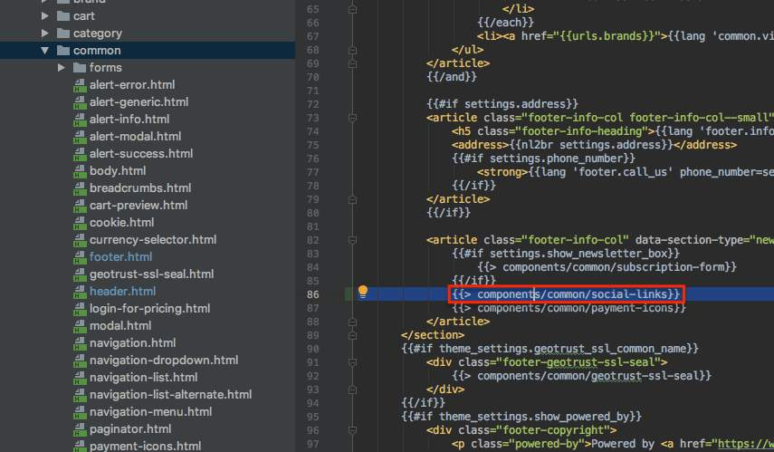


### Step 3 - Add a New Component

1. **Right** click on Component
2. **Select** _New > HTML File_

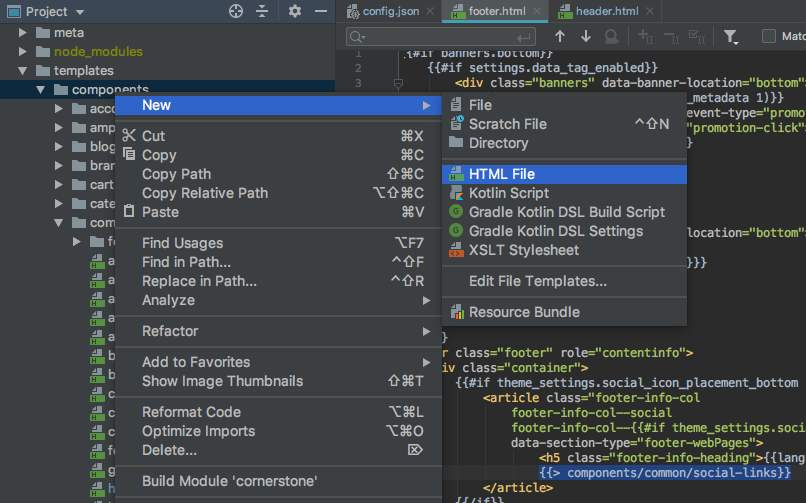

3. **Name** the new file &quot;test.html&quot; and **click** _OK_
4. **Replace** the contents of the new file with plain text (ex. TEST)

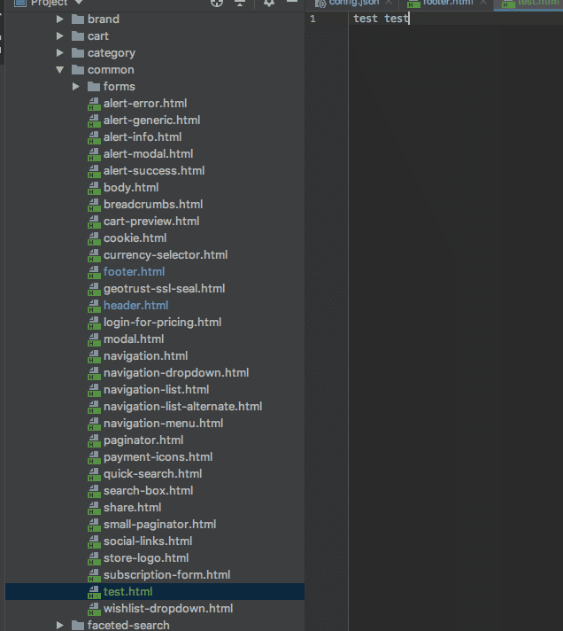

5. **Add** the new component to the footer.html file directly under the payment-icons component

```text showLineNumbers={false}
{{> components/common/test}}
```

6. **Observe** test component text on storefront

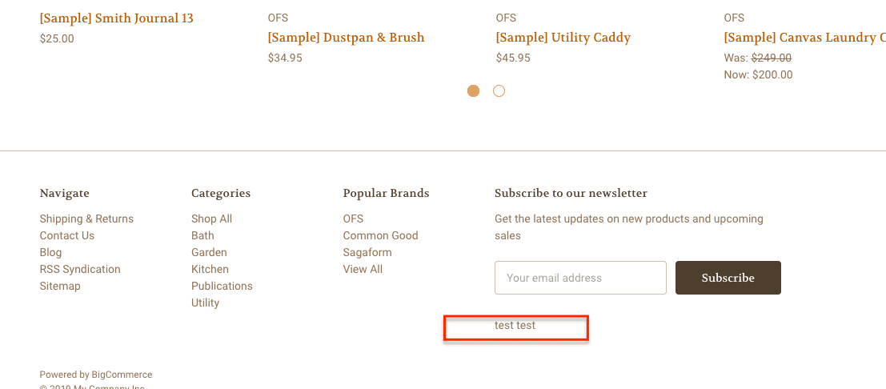

## Layout

You can apply custom layout files from templates/layouts to any page including the account portal, search results, and checkout. As long as there's a file in templates/pages, you can give it a custom layout file from templates/layouts.

### Step 1: Create New Layout and Apply it to a Page

1. **Navigate** to _/templates/layout_
2. **Open** base.html
3. **Copy** the contents of base.html
4. **Create** a new file /templates/layout/new-layout.html
5. **Paste** the previously copied code into the new file
6. **Remove** the footer component in the newly created layout file

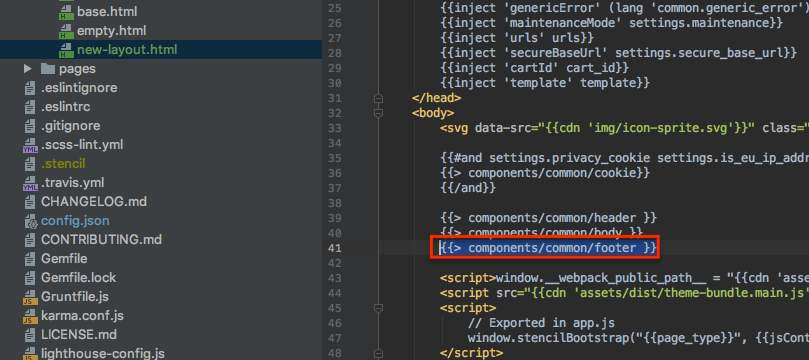

7. **Open**/templates/pages/product.html
8. **Change** the layout file that's called at the bottom from 'base' to 'new-layout'

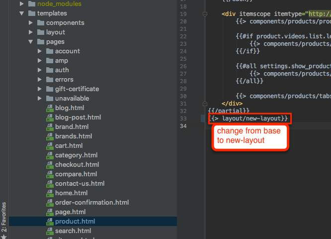

9. **View** product page
10. **Observe** footer no longer appears

### Step 2: Make Changes in a Page File's Front Matter and Identify the Results

1. **Identify** the default values in config.json for the homepage new products count key:

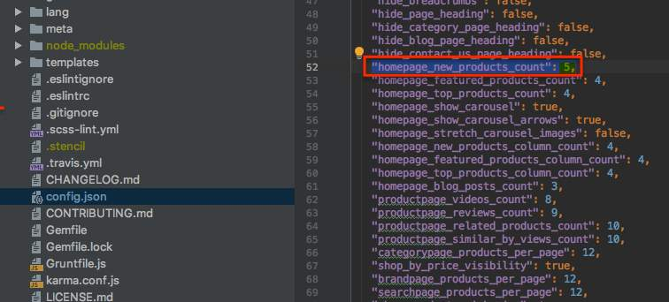

2. **Open** your templates/pages/home.html file in your editor
3. **Note** the reference to the homepage new products count key in the file's front matter, between the two `---` delimiters

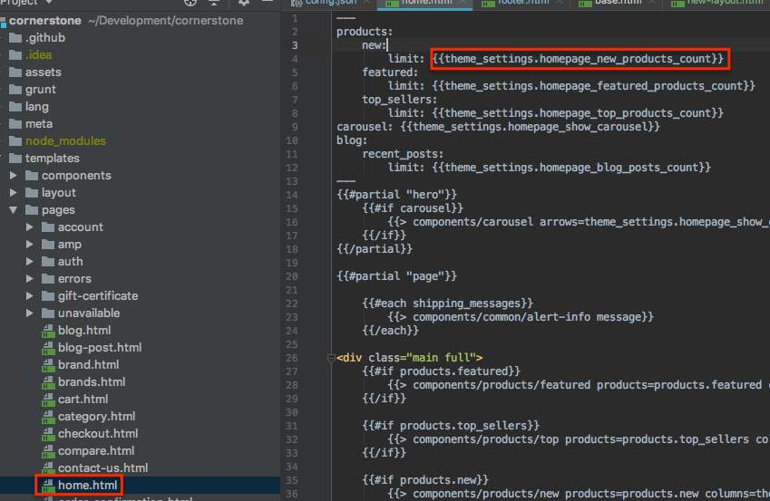

4. **Load** your storefront's homepage (by default, `http://localhost:3000)` and you should see a "New Products" section that displays 5 products
5. **Change** the limit: \{\{theme settings homepage new products count\}\} statement to a hard-coded limit: **2**

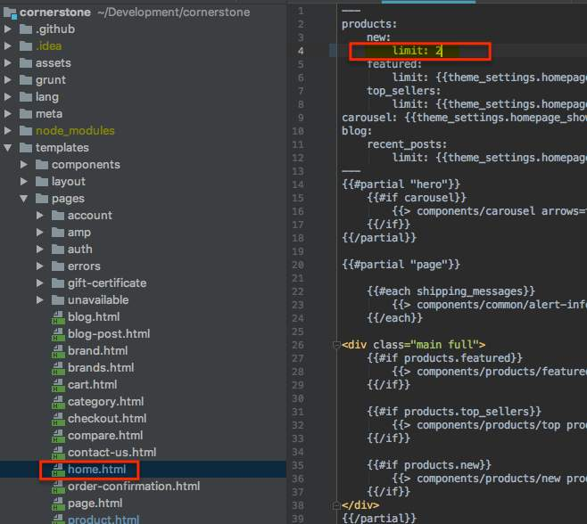

6. **Reload** your storefront's homepage in your browser, you should see the number of displayed "New Products" change from its default number (as specified in config.json) to two

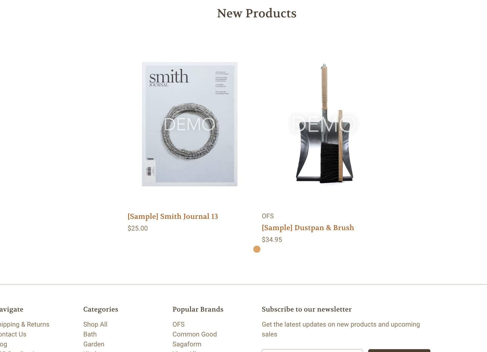

