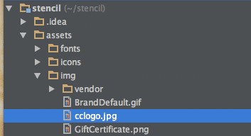
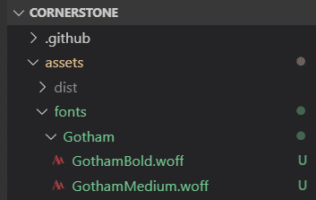
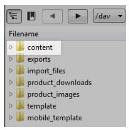
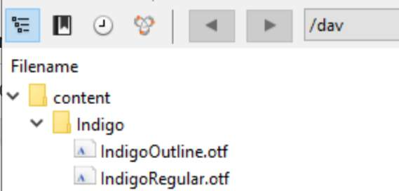

# Lab - Assets

**Prerequisites**

* Previous labs have been completed

## Customize Assets

### Step 1: Add an Image to the Theme Footer

1. **Save** the image below as cclogo.jpg:


2. **Drag** and **drop** it into the `<theme-name>/assets/img` directory of your Stencil theme



3. **Navigate** to _templates/components/common/footer.html_
4. **Add** the following code above the footer copyright:

```jsx showLineNumbers={false}
<div class="cc-logo">
    
 </div>
```

5. **Observe** credit card logos on the storefront

## Add a Custom Font

### Applying Custom Fonts

There are two paths to take for using custom fonts:

- Change to a new Google Font
- Use a custom font

### Google Fonts

[Google Fonts](https://fonts.google.com/) is a collection of open source fonts available for use. The base Cornerstone theme uses Karla and Montserrat. Google Fonts come included in the Cornerstone theme. In _config.json_ update each place you want the change with the name of the new Google Font.

Make sure it follows of the format _Google_FontName_Weight_.

### Add a Custom Font Bundled with the Theme

#### Step 1: Add Font Files to the Theme

1. **Create** a new directory in _assets/fonts_<br />
   ex. /assets/fonts/Gotham
2. **Drag** and **drop** the font files into the new directory



#### Step 1.2: Create Font Face Rules for Each Version on the Font in the New Directory

1. **Open** the main layout template file at _templates/layout/base.html_
2. Within the `<head>` block, **add** a style block with @font-face rules for each version of the font in the new directory

```jsx showLineNumbers={false}
<style type="text/css" media="screen,print">
    @font-face {
        font-family: "Gotham";
        src: url("{{cdn 'assets/fonts/Gotham/GothamMedium.woff'}}") format("woff");
        font-style: normal;
        font-weight: 400;
    }
    @font-face {
        font-family: "Gotham";
        src: url("{{cdn 'assets/fonts/Gotham/GothamBold.woff'}}") format("woff");
        font-style: normal;
        font-weight: 700;
    }
</style>
```

Note the use of the _cdn_ helper to reference the asset file.

#### Step 1.3: Add the New Font to Available Schema

To make sure the new font is available in the fonts list when editing in Page Builder, add it in _schema.json_.

1. **Open** the file _schemaTranslations.json_
2. **Add** translated labels related to the new font

```css showLineNumbers={false}
"i18n.Gotham": {
    "default": "Gotham"
  },
"i18n.GothamBold": {
    "default": "Gotham Bold"
  },
```

3. **Open** the file _schema.json_
4. **Locate** the "options" group for the "headings-font" setting
5. **Add** the new font options to the array

```json showLineNumbers={false}
{
  "type": "font",
  "label": "i18n.HeadingFontFamily",
  "id": "headings-font",
  "options": [
    {
      "group": "i18n.Gotham",
      "label": "i18n.Gotham",
      "value": "Gotham_400"
    },
    {
      "group": "i18n.Gotham",
      "label": "i18n.GothamBold",
      "value": "Gotham_700"
    },
    ...
  ]
}
```

#### Step 1.4: Use Your New Font in the Theme

1. **Open** the _config.json file_ in the top level of the theme directory
2. **Locate** the "headings-font" setting
3. **Replace** the original font family with your new font family name<br/>
   ex: `"headings-font": "Gotham_700"`
4. **View** the new font on your storefront

Note that your new default value in _config.json_ should match the "value" of one of the available font settings you added in _schema.json_.

### Add a Custom Font Hosted Outside the Theme

#### Custom Fonts

Custom fonts can be used in any theme. To use a custom font, upload it to the stores _/content/_ folder in [WebDav](https://support.bigcommerce.com/s/article/File-Access-WebDAV?language=en_US).



  For more information on custom fonts, go to: [Custom Fonts and
  Icons.](/developer/docs/storefront/stencil/themes/style/fonts-and-icons)

#### Step 2: Add Font Files to WebDAV

1. **Connect** to WebDAV using these instructions: [https://support.bigcommerce.com/s/article/File-Access-WebDAV](https://support.bigcommerce.com/s/article/File-Access-WebDAV)
2. **Drag** and **drop** the font files into the content directory



  You cannot create new top-level directories in WebDAV, but you can create new
  subdirectories. If you receive a permissions error trying to create a
  subdirectory, try dragging a folder created on your desktop into the target
  directory in WebDAV

#### Step 2.1: Create Font-Face CSS Rules to Load Your Font

1. **Create** a new scss file in the assets/scss/fonts directory <br />
   Ex: assets/scss/fonts/\_indigo.scss
2. **Create** @font-face rules for each version of the font in the new directory

```scss showLineNumbers={false}
@font-face {
    font-family: "Indigo Regular";
    font-style: normal;
    font-weight: 400;
    src: url("https://mybigsandbox.com/content/Indigo/IndigoRegular.otf") format("truetype");
}

@font-face {
    font-family: "Indigo Outline";
    font-style: normal;
    font-weight: 400;
    src: url("https://mybigsandbox.com/content/Indigo/IndigoOutline.otf") format("truetype");
}
```

**Referencing from the CDN**

Any time a file is uploaded to the /content/ directory, it is best to reference it from the CDN. The steps in this lab reference the font from the store's domain, but you can use the URL structure below to access the /content/ directory on the CDN:

`https://cdn11.bigcommerce.com/s-&lt;STORE_HASH&gt;/content/`

#### Step 2.2: Import Your New SCSS File

1. **Navigate** to _assets/scss/fonts directory_
2. **Open** the assets/scss/fonts/\_fonts.scss file
3. **Add** the following to the top of the file:

```scss showLineNumbers={false}
@import "indigo";
```

#### Step 2.3: Use Your New Font in the Theme

1. **Navigate** to the _config.json file_ in the top level of the theme directory
2. **Locate** a key-value pair that sets a font family <br />
   ex: `"body-font": "Google_Karla_400"`
3. **Replace** the original font family with your new font family name <br />
   ex: `"body-font": "Indigo Regular"`
4. **View** the new font on your storefront

#### Step 3: Add a New Google Font Reference to config.json

1. **Navigate** to the _config.json file_ in the top level of the theme directory
2. **Locate** a key-value pair that sets a font family <br />
   ex: `"headings-font": "Google_Montserrat_400"`
3. **Update** the value with the format `"Google_Font+Name_FontWeight"` <br />
   ex: `"headings-font": "Google_Lobster+Two_700"`

When you create @font-face rules be sure to choose a font weight that is available on Google. If you choose a weight that is not available on Google, it won&#39;t exist and it will default to the browser default font.

4. **View** the new font on your storefront

Google font support is included in the base Cornerstone theme. Other marketplace themes may not come with this built-in.

