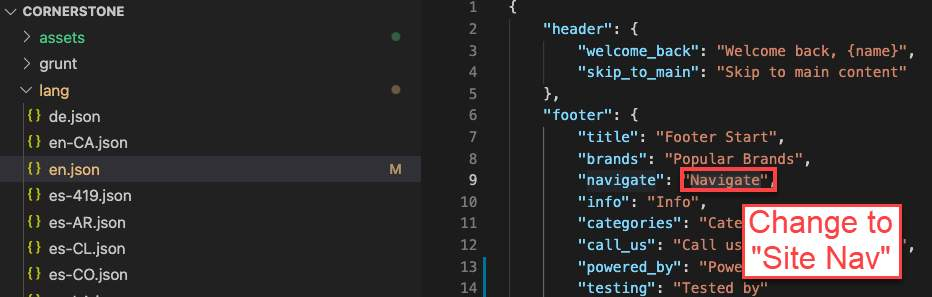
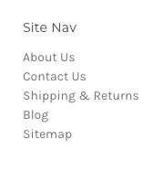
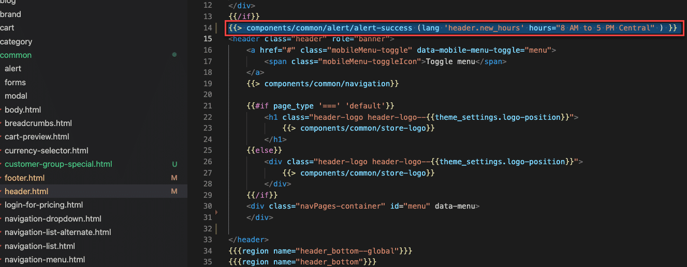
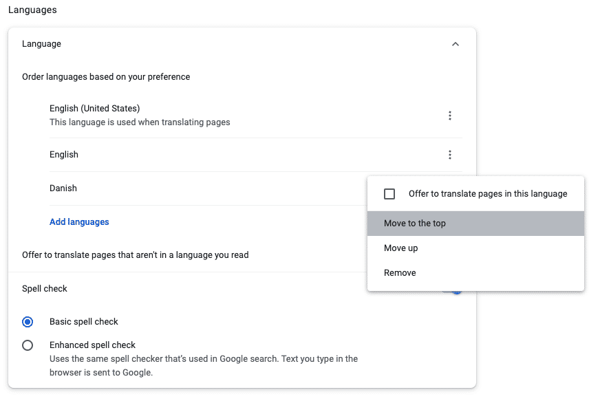
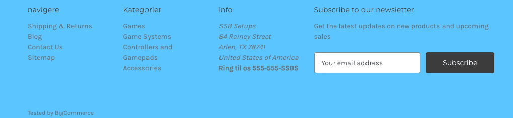

# Lab - Language File

**Prerequisites**

* Previous labs have been completed
* Store profile is set to display the language based on the user&#39;s browser setting

## Step 1: Edit an Existing Translation Key in en.json

1. **Navigate** to _lang > en.json_
2. **Change** the "footer" text string for "navigate" from "Navigate" to "Site Nav"



3. **Observe** change in footer on storefront



## Step 2: Create a New Translation Key in en.json

1. **Navigate** to _lang > en.json_
2. **Add** another key value pair under header:

```text showLineNumbers={false}
"new_hours": "Summer hours: {hours}"
```

.jpg)

3. **Edit** the /templates/components/common/header.html
4. **Add** the following code after the \{\{/if\}\} tag and before the `<header>` tag:

```text showLineNumbers={false}
{{> components/common/alert/alert-success (lang 'header.new_hours' hours="8 AM to 5 PM Central" )}}
```



5. **Observe** the new component at the top of your site:

.png)

## Step 3: Create a New Language File

1. **Right-click** the lang folder
2. **Select** New > File
3. **Name** the new file da-DK.json
4. **Copy** the Danish translated footer values below and paste into the da-DK.json file


```json showLineNumbers={false}
{
    "footer": {
        "brands": "maerker",
        "navigate": "navigere",
        "info": "info",
        "categories": "Kategorier",
        "call_us": "Ring til os {phone_number}"
    }
}
```

## Step 4: Test New Language File

1. Using the Chrome browser, **Navigate** to _Settings > Advanced > Language_
2. **Add** a new language Danish - dansk
3. **Move** to the top of the priority list



4. **Observe** translated footer:



