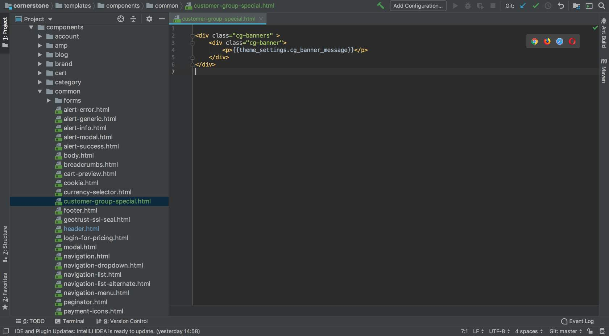
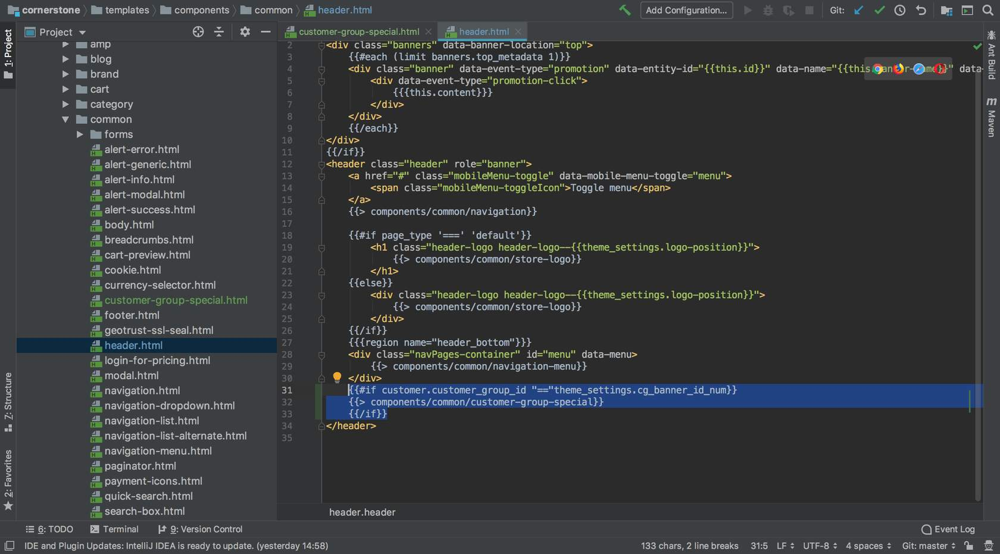

# Lab - End to End Component

**Prerequisites**

* Previous labs have been completed

## Step 1: Create a Customer Group and Assign a Customer

1. **Log in** to your store's control panel
2. **Navigate** to _Customers > Customer Groups_
3. **Enter** a name for your Customer Group and **Save** and **Exit**
4. **Navigate** to _Customers > Add_
5. **Enter** the required details to create a customer
6. **Assign** the new customer to the newly created Customer Group
7. **Save** and **Exit**

## Step 2: Create a New Component for Customer Group-Specific Messaging

1. **Navigate** to the _templates/components/common_ directory
2. **Add** a new HTML file named _customer-group-special.html_ to the directory
3. **Inside** the new file, add the following code:

```jsx showLineNumbers={false}
<div class="cg-banners" >
    <div class="cg-banner">
        <p>{{theme_settings.cg_banner_message}}</p>
    </div>
</div>
```



This creates a new component with a text field that will be editable in the Theme Editor.

## Step 3: Add the New Component to the Header

1. **Navigate** to the _templates/components/common/header.html_ file
2. **Add** the following to the header.html file just before the `</header>` tag:

```text showLineNumbers={false}
{{#if customer.customer_group_id "==" theme_settings.cg_banner_id_num}}
    {{> components/common/customer-group-special}}
{{/if}}
```



This makes the new component render in the header, if a customer in a specific group is logged in. The target group will be specified within the theme editor.

## Step 4: Create a New custom.scss File

1. **Navigate** to the _assets/scss_ directory
2. **Create** a new file in the assets/scss directory named _custom.scss_
3. **Paste** the following scss into the new file:

```scss showLineNumbers={false}
.cg-banners {
    background-color: stencilColor("cg-background-primary");
    color: stencilColor("cg-banner-text");
    text-align: center;
    padding: 3px;

    p:last-child {
        margin-bottom: 0;
    }

    a {
        color: color("whites", "bright");
    }
 }
```

## Step 5: Import the new _custom.scss_ File in the theme.scss File

1. **Navigate** to the _templates/assets/scss/theme.scss_ file
2. **Add** the following at the bottom of the file:

```scss showLineNumbers={false}
@import "custom";
```

## Step 6: Create Key Value Pairs in config.json for the Customization Defaults on the New Component

1. **Navigate** to the _config.json_ file in the main theme directory
2. **Add** the following to the top of the "settings" section of the config.json file:

```text showLineNumbers={false}
"cg_banner_message": "special customer group text",
"cg_banner_id_num": "1",
"cg-background-primary": "#bbbbbb",
"cg-banner-text": "#ffffff",
```

"cg_banner_id_num": "1", needs to match the customer group id for the group being tested against. In order to do this, you must have a customer group, have a customer in that group, and be logged in as that customer on the localhost.

## Step 7: Add to schema.json to Allow the New Component to be Customized Through Theme Editor

1. **Navigate** to the _schema.json_ file in the main theme directory
2. **Add** the following to the top of the Header section's settings in the schema.json file:

```json showLineNumbers={false}
{
  "type":"heading",
  "content":"Customer Group Banner"
},
{
  "type":"text",
  "label":"Customer Group Banner Message",
  "id":"cg_banner_message",
  "force_reload":true
},
{
  "type":"text",
  "label":"Customer Group ID",
  "id":"cg_banner_id_num",
  "force_reload":true
},
{
  "type":"color",
  "label":"Customer Group Banner Text color",
  "id":"cg-banner-text"
},
{
  "type":"color",
  "label":"Customer Group Banner Background Color",
  "id":"cg-background-primary"
},
```

You will be able to preview your changes through Page Builder once the theme has been deployed.

