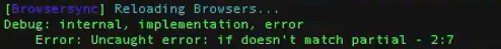

# Lab - Debugging Your Stencil Theme

## Introduction

The Stencil framework provides built-in debugging tools to aid in your custom frontend development. It's always a good practice to uncover what's happening behind the scene as we make changes. It's a good way to debug code you have inherited or when you want to see what data is available on the page you are working on, you can simply add the debug query string to your store's localhost URL.

This lab aims to enhance the understanding of Stencil objects, explore the connection between Config/Schema and Handlebars, and learn how to create and conditionally import components, and styling techniques.

**Prerequisites**

* Previous labs have been completed

You can use the debug query string on any page in your store's localhost URL to get a list of all of the objects available on the page.

## Step 1: Using Query String

1. **Add** `?debug=context` to the end of the page URL you are on:


2. **Note** the full page output of all available objects, in JSON syntax
3. **Switch** the debug URL to instead show `?debug=bar` like below:


4. **Note** the debug output now shows the available objects and the rendered page at the same time. The available objects will appear in the footer

## Step 2: Debug in Terminal/Shell

1. **Navigate** to `<theme-name>/templates/pages/home.html` in your chosen editor
2. **Locate** the first section of Handlebars expressions at the top of the file

```text showLineNumbers={false}
{{#partial "hero"}}
   {{#if carousel}}
       {{> components/carousel}}
   {{/if}}
{{/partial}}
```

3. **Delete** one of the brackets at the end of the first expression:

```text showLineNumbers={false}
{{#partial "hero"}}
   {{#if carousel}}
       {{> components/carousel}}
   {{/if}}
{{/partial}}
```

4. **Re-render** the home page in your browser
5. **Note** the error in the browser appears as `{"statusCode":500,"error":"Internal Server Error","message":"An internal server error occurred"}`
6. **Swap** to your Terminal/Shell window
7. **Note** the error that appears, indicating a missing close bracket on line 1 below the front-matter attributes:

```bash showLineNumbers={false}
Debug: internal, implementation, error
    Error: Uncaught error: Parse error on line 1:
    {{#if carouse}
-----------------^
Expecting 'CLOSE_RAW_BLOCK', 'CLOSE', 'CLOSE_UNESCAPED', 'OPEN_SEXPR', 'CLOSE_SEXPR', 'ID', 'OPEN_BLOCK_PARAMS', 'STRING', 'NUMBER', 'BOOLEAN', 'UNDEFINED', 'NULL', 'DATA', got 'INVALID'
    at Object.parseError // ...
```

8. **Add** the missing bracket back to the end of the first expression:

```text showLineNumbers={false}
{{#partial "hero"}}
   {{#if carousel}}
       {{> components/carousel}}
   {{/if}}
{{/partial}}
```

9. **Delete** the \{\{/if\}\} expression from the same section:

```text showLineNumbers={false}
{{#partial "hero"}}
   {{#if carousel}}
       {{> components/carousel}}

{{/partial}}
```
10. **Re-render** your home page in your browser
11. **Swap** to your Terminal/Shell window
12. **Note** the new error log, indicating that number of if and /if do not match up:


