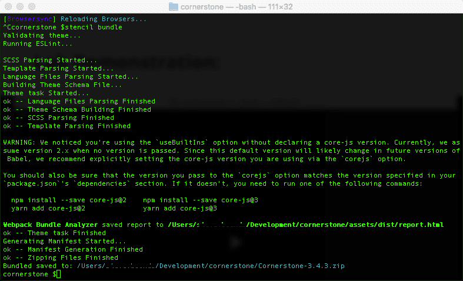
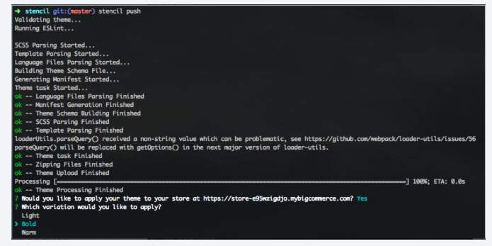

# Lab - Bundling and Uploading a Theme

## Bundling

.png)

**Prerequisites**

* Previous labs have been completed

### Introduction

You have verified all requirements have been met. Stencil CLI provides two options for creating a .zip file that contains all your theme's essentials, while excluding redundant components A theme's zip file must be no larger than 50 MB. If your file exceeds that size, use either a WebDAV or a CDN upload to exclude large static assets.

**Writable Permissions Are Required**

Without these permissions, bundling your theme will fail, blocking its upload to BigCommerce.

**No Automatic Check for Dependencies**

The _stencil bundle_ and _stencil push_ commands do not check for the dependencies that these build systems install. So if those dependencies are missing, these commands will not immediately report errors. However, your resulting .zip file will not properly upload to BigCommerce, and will not run properly on a storefront.

**Verify Directory and File Permissions**

If you have added any new subdirectories or files to your base theme, verify that you have:

Set newly added directories to permission 755 (drwxr-xr-x). Set newly added files to permission 644 (rw-r--r--).

### Step 1: Bundle a Theme

1. Enter the following command in CLI:

```bash showLineNumbers={false}
stencil bundle
```

2. The _bundle_ command will notify you of its progress and completion
3. A _.zip_ file is generated

Check the resulting .zip file's size. (It cannot exceed 50 MB). If your .zip file meets this requirement you are now ready to [upload your theme](http://docs.bigcommerce.com/developer/docs/storefront/stencil/deployment/upload).

If your .zip file exceeds 50 MB, you will need to use one of the following procedures to restructure your theme to a size that is manageable for upload to BigCommerce:

1. Shrink Your Theme with the help of WebDAV
2. Stage your Theme for CDN Delivery to restructure your theme to a size that's manageable to upload to BigCommerce

#### Successful Bundling

Stencil CLI will display:
* "ok" confirmations
* "not ok" errors
* warnings for individual substeps in bundling and uploading your theme
If bundling is successful, you will next see a "Processing" progress bar to track the upload.



If bundling your theme triggers multiple lint errors related to the bundle.js file, then your theme is missing the .eslintignore file. Please retrieve this file from the Stencil Cornerstone repo, then re-run stencil bundle or stencil push.

## Uploading

### Introduction

BigCommerce provides two options for uploading a theme to your BigCommerce store.

1. Control Panel Upload
2. Command Line Upload (used in this course)

### Step 1: Bundle and Push

1. **Enter** the following command in CLI:

```bash showLineNumbers={false}
stencil push
```

2. **Enter** _y_ to apply the theme to your store
3. **Select** the theme variation you would like to apply
4. **Navigate** to the _URL of the store_ to view the applied theme

**Command Line Upload (OAuth Required)** This stencil push command allows you to both bundle and upload your theme to the store with a single terminal command and in one continuous process. The _stencil push_ command is available only for themes that you have successfully initialized using an **OAuth Token** (with _Themes: modify scope_).

Stencil CLI is designed to display the same notifications, prompts and selection options that you would receive when using the control panel's GUI.

#### Successful Upload

Upon a successful upload, you will be prompted: _Would you like to apply your theme to your store at &lt;domain&gt;? (y/n)_ Any response except _y_ or _Y_ will be processed as "No." You can always apply the theme later through the control panel.



#### Apply Which Variation?

If you chose to apply the newly uploaded theme, you will be prompted with: &quot;Which variation would you like to apply?&quot;

Use your arrow keys to move the selection caret/highlight to the variation you want, and then press _Enter_.

Stencil CLI will then confirm which variation is active on the storefront.

**Automatically Apply a Variation and Pushing a Theme to Selected Channels**

* To push a theme and activate a particular variation without being prompted, use `stencil push -a VARIATION_NAME` with the name of the variation.
* To push a theme and apply it to selected channels, use `stencil push -a -c 123 456`. To apply a theme to all available channels, use `stencil push -a -allc`.
