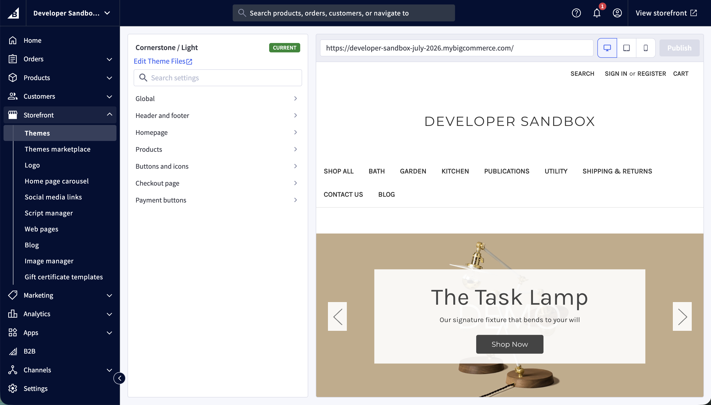

# Lab - Test Custom Theme Settings

**Prerequisites**

* Previous labs have been completed
* Your customized theme has been bundled and uploaded to the store

## Introduction

Throughout the customization labs, you added settings to _config.json_ and _schema.json_ that surface in **Theme Styles** in the control panel. Now that your theme is uploaded to the store, you can open Theme Styles and confirm that each customization appears and behaves as expected.

## Step 1: Open Theme Styles

There are two paths for reaching Theme Styles in the control panel:

* **From Page Builder** — open Page Builder for your storefront and select the Theme Styles panel to edit the colors, fonts, and other settings your theme exposes.
* **From the channel (Makeswift-enabled storefronts)** — open the channel's entry in the control panel and click the dedicated **Theme Styles** button, shown alongside **Edit in Makeswift**.

To open Theme Styles through Page Builder:

1. **Log in** to your store's control panel
2. **Navigate** to _Storefront > Themes_
3. **Locate** your uploaded theme and **click** Customize to open Page Builder
4. **Select** the Theme Styles panel

**Makeswift on Stencil is currently in Beta; features and availability are subject to change.** To reach the same Theme Styles from Makeswift, return to the dashboard and select the **Edit Theme Styles** button directly next to the **Edit in Makeswift** option.

Any setting you declared in _schema.json_ appears in Theme Styles. If a setting is missing, confirm it has a matching key in _config.json_ — a _schema.json_ entry without an `id`-matched _config.json_ key will not appear.

## Step 2: Verify Variations and config.json Settings

1. **Confirm** the new variation you created in the config.json lab appears at the top of Theme Styles
2. **Select** the variation and **verify** the footer background color reflects your `footer-backgroundColor` value (`#66ccff`)
3. **Verify** the carousel arrow color and background color match the values you set
4. **Verify** the homepage new products count from the layout lab reflects your configured value

## Step 3: Verify the Custom Font

1. **Open** the typography or fonts section of Theme Styles
2. **Locate** the Heading font setting
3. **Confirm** your custom font (for example, _Gotham_) appears as an option in the font list
4. **Select** the custom font and **preview** the change on the storefront

The custom font appears in the font list because you added it to the `headings-font` options in _schema.json_. If it is missing, revisit the schema changes from the custom font lab.

## Step 4: Verify the Customer Group Banner Fields

1. **Open** the Header section of Theme Styles
2. **Confirm** the Customer Group Banner section appears with the following fields:
   * Customer Group Banner Message (text)
   * Customer Group ID (text)
   * Customer Group Banner Text color (color)
   * Customer Group Banner Background Color (color)
3. **Enter** a banner message and the ID of a customer group
4. **Choose** a text color and background color
5. **Preview** the storefront as a customer in that group to confirm the banner renders with your settings

## Step 5: Preview and Save

1. **Review** your changes in the Theme Styles preview
2. **Save** the changes to apply them to the storefront

Open only one instance of Theme Styles against a storefront at a time. There is no synchronization mechanism to reconcile changes made by multiple instances, so changes saved in one instance may be lost.

## Resources

* [Theme Styles Configuration](https://docs.bigcommerce.com/developer/docs/storefront/stencil/themes/foundations/customizability)
* [Theme Objects and Properties](https://docs.bigcommerce.com/developer/docs/storefront/stencil/themes/context/object-reference/schemas)
